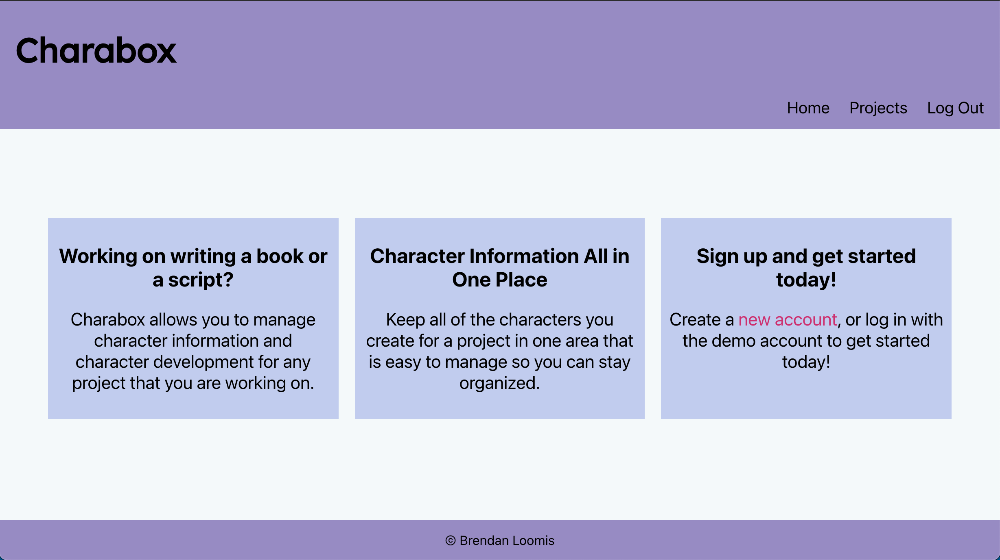

# Charabox API
https://charabox.vercel.app/

API for Charabox.

## Client Repo 
https://github.com/brendanloomis/charabox

## API Endpoints
### API URL
https://charabox-api.herokuapp.com/api

### GET
* '/users/usernames' get all usernames
* '/projects' Parameter: userId (number). Get projects for a specific user
* '/characters' Parameter: projectId (number). Get characters for a specific project
* '/notes' Parameter: characterId (number). Get notes for a specific character

### POST
* '/users' adds a user
* '/users/login' used for logging in
* '/projects' adds a project
* '/characters' adds a character
* '/notes' adds a note

### DELETE
* '/projects/:project_id' deletes a project by changing it to inactive
* '/characters/:character_id' deletes a character by changing it to inactive
* '/notes/:note_id' deletes a note by changing it to inactive

### PATCH
* '/projects/:project_id' updates a project
* '/characters/:character_id' updates a character
* '/notes/:note_id' updates a note

## Summary

Charabox is an application that can be used for creative writers to keep track of the character development for their projects. Users can add projects, characters to the projects, and notes for the characters. Users can also edit the information for their projects, characters, and notes. There is a demo account that can be used to try the app out (username: demo, password: pass123word).

## Technology Used
* Front-End
    * React
    * JavaScript
    * HTML
    * CSS
    * Jest
    * Deployed with Vercel

* Back-End:
    * Node
    * Express
    * PostgreSQL
    * Mocha
    * Chai
    * Supertest
    * Deployed with Heroku